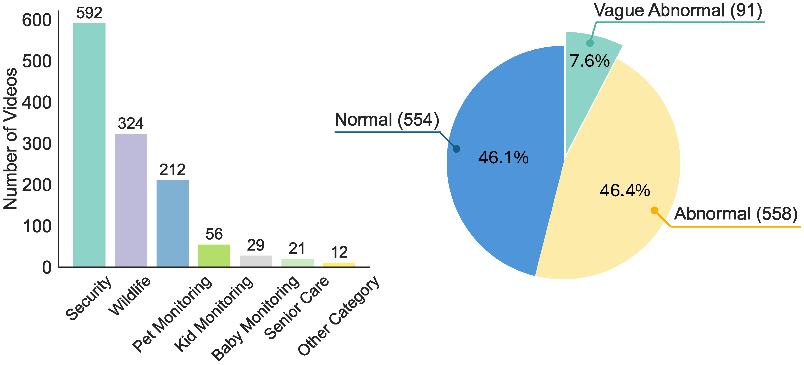
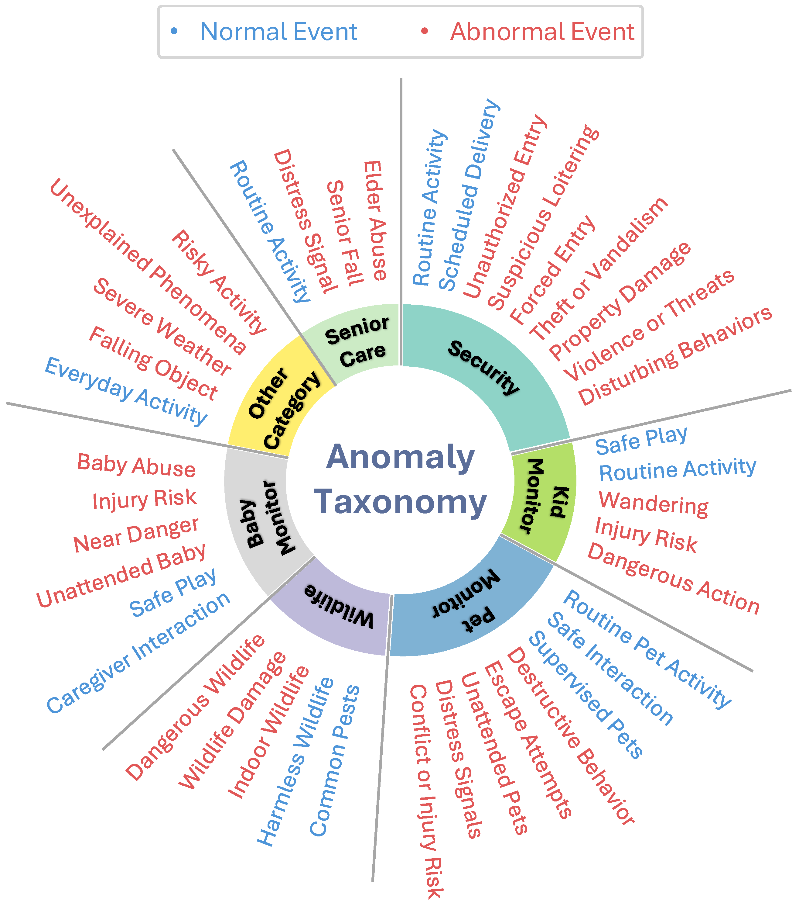
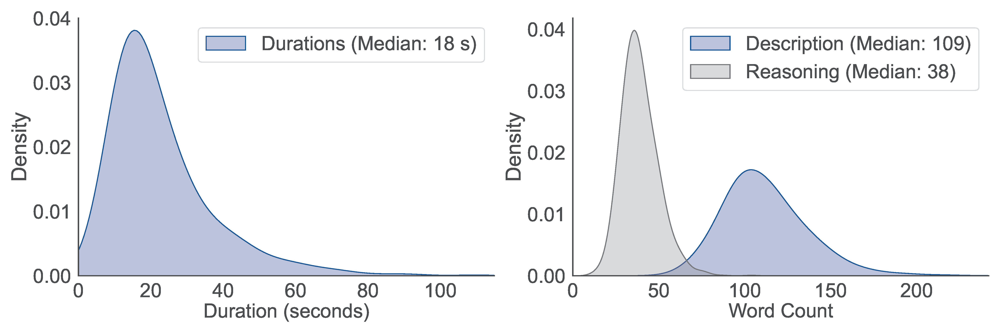

<h2 align='center'>
    SmartHome-Bench
</h2>

<h4 align='center'>
SmartHome-Bench: A Comprehensive Benchmark for Video Anomaly Detection in Smart Homes Using Multi-Modal Large Language Models
</h4>

[](https://ise.washington.edu/)
[](https://www.wyze.com/)

This work was completed during an internship at [Wyze](https://www.wyze.com/?srsltid=AfmBOoq6653qRzuw0ouHRr848XPkFt7mBjkACVbS97P6tHOdcD3DbuAn).

<p align="center">
 
    <br>
    <em>Fig. 1 Distribution of Video Anomaly Tags and Taxonomy Categories.</em>
</p>


## :star: Features

**SmartHome-Bench** is the first video dataset specifically designed for smart home surveillance scenarios. It serves as a benchmark not only for video anomaly detection (VAD) but also offers a versatile evaluation platform to comprehensively assess the performance of multi-modal large language models (MLLMs) in video reasoning and interpretation. Please see our paper here: (add link).

-  :house: First benchmark specifically designed for detecting anomalies in smart home videos.
- :movie_camera: Dataset includes 1,203 video clips, each annotated with:
  - Detailed video description; 
  - Anomaly or normality reasoning;
  - Binary anomaly tag (0 for normal, 1 for abnormal)
- :triangular_ruler: Introduction of the first video anomaly taxonomy, covering seven common scenario categories.
- :fire: Evaluation of state-of-the-art closed-source and open-source LLMs using various prompting techniques.


<!--
##   :books: Anomaly Taxonomy
-->
<p align="center">
 
    <br>
    <em>Fig. 2 Overview of the video anomaly taxonomy in smart homes.</em>
</p>


<!--
>Figure 2 provides an overview of this taxonomy, which covers seven categories of scenarios that frequently occur at home and are of concern to users. Each category is further divided into normal and abnormal videos, with detailed descriptions provided for both.
-->

<!--
>For instance, the taxonomy for the **Wildlife** category includes the following situation for normal videos and abnormal videos:
-->
<!--
- **Normal Videos**:
  - **Harmless Wildlife**: Harmless wildlife sightings, such as squirrels, birds, or rabbits, moving through the yard.
  - **Common Pests**: Common pest activity that doesn’t pose immediate danger (e.g., bugs in the garden).

- **Abnormal Videos**:
  - **Dangerous Wildlife**: Presence of dangerous wildlife like snakes, spiders, or raccoons that may pose a health risk.
  - **Wildlife Damage**: Any wildlife activity that causes or potentially causes damage to property or threatens human or pet safety.
  - **Indoor Wildlife**: Any wildlife (dangerous or not) that enters a home without clear containment.

-->


## :minidisc: Video Collection

1. Videos were collected primarily from public resources, such as YouTube, based on seven taxonomy categories.
2. Specific keywords were developed for each category to guide the search.
   - Example: "cat play home cam" for normal pet monitoring footage, and "pet vomit home cam" for abnormal events.
3. Videos were scraped using these keywords and carefully screened to ensure they were exclusively captured by smart home cameras.


<!--
##   :bar_chart: Dataset Statistics

Our **SmartHome-Bench** dataset consists of 1,203 smart home video clips across 7 categories. As shown in Figure 1, the dataset is balanced, with a similar number of abnormal and normal videos. Among the 7 categories, the security category contains the most videos.
-->


<p align="center">
 
    <br>
    <em>Fig. 3 Distribution of Video Duration, Description Word Count, and Reasoning Word Count.</em>
</p>

<!--

>Figure 3 presents the distribution of the time durations for these 1,203 video clips, as well as the word count distribution for the descriptions and reasoning annotations, offering insights into the complexity of the videos.

- The majority of smart home video clips are shorter than 80 seconds.
- Reasoning annotations are typically more concise than descriptions, as they focus only on the key event leading to the anomaly tag.
- Descriptions provide a more detailed account of all events in the video.
-->

## :wrench: How to Use
### Clone the Repository
1. Clone this repository and navigate to the SmartHome-Bench-LLM folder:
```bash
git clone https://github.com/Xinyi-0724/SmartHome-Bench-LLM.git
cd SmartHome-Bench-LLM
```
2. Install the required packages:
```bash
pip install -r requirements.txt
```

### Download Videos
1. The video URLs are provided in an Excel file [Video_url.csv](https://github.com/Xinyi-0724/SmartHome-Bench-LLM/tree/main/Videos/Video_url.csv) of this GitHub repository.
   - The first **1,023 videos** can be downloaded from YouTube using the provided URLs.
   - The remaining **180 videos**, contributed by our staff, are private and cannot be downloaded.

2. After downloading the videos, make sure each video file is named exactly as listed in the "Title" column of [Video_url.csv](https://github.com/Xinyi-0724/SmartHome-Bench-LLM/tree/main/Videos/Video_url.csv), and place them in the following folder: SmartHome-Bench-LLM/Videos/Trim_Videos/raw_video.

3. To extract the specific video clips used in our paper, run the trimming script:
```bash
cd SmartHome-Bench-LLM/Videos/Trim_Videos
python Video_trim.py
```
This will generate the trimmed video clips and save them to: SmartHome-Bench-LLM/Code/downloads/.

4. The complete video annotation details for all 1,203 videos can be found in [Video_Annotation.csv](https://github.com/Xinyi-0724/SmartHome-Bench/blob/main/Videos/Video_Annotation.csv).

### Set Up API Keys
Before running the models, you need to configure the necessary API keys by setting up the environment variables listed in the [.env.template](https://github.com/Xinyi-0724/SmartHome-Bench-LLM/blob/main/Code/.env.template) file.
1. For **Gemini-1.5-flash**, **Gemini-1.5-pro**, and **Claude-3.5-sonnet**, you must provide a valid Google Cloud Project ID:
```bash
PROJECT_ID=your-vertex-ai-project-id
```
2. For **GPT-4o** and **GPT-4o-mini**, you must include your actual OpenAI API key:
```bash
OPENAI_API_KEY=your-openai-api-key
```
After filling in the required values, save the file as `.env` in the `Code/` directory. This file is used to authenticate and run the corresponding models.

### Run Models and Evaluate
You can run our experiments using either closed-source or open-source models by specifying the model, method, and evaluation step.
#### :green_circle: Closed-Source Models ####
- **Supported Models:**
Gemini-1.5-flash-001, Gemini-1.5-pro-001, GPT-4o-2024-08-06, GPT-4o-mini-2024-07-18, and Claude-3.5-sonnet@20240229

- **Supported Methods:**
Zero-Shot, Few-Shot, Chain-of-Thought (CoT), In-context Learning (ICL), LLM Chaining

- **Steps:**
    - For zero-shot, few-shot, CoT, ICL:
        - `Step1`: Generate model responses
        - `Step2`: Calculate accuracy
    - For LLM Chaining:
        - `Step1`: Generate initial model responses
        - `Step2`: Generate rule-based self-reflection
        - `Step3`: Calculate accuracy
    
- **Arguments:**
    - model_name: Flash, Pro, GPT, GPTmini, Claude
    - method_name: zeroshot, fewshot, COT, ICL, LLMChain
    - step: Step1, Step2, Step3
    - example usage: python run.py --model Flash --method zeroshot --step Step1

- **Command:** 
```bash
cd SmartHome-Bench-LLM/Code
python run.py --model <model_name> --method <method_name> --step <step>
```

</div>

#### :yellow_circle: Open-Source Model: VILA ####

We integrate with [VILA](https://github.com/NVlabs/VILA) for open-source experiments.

- **Supported Methods:**
Zero-Shot, Few-Shot, Chain-of-Thought (CoT), In-context Learning (ICL)

- **Steps:**
    - `Step1`: (Already completed) Model-generated responses have been collected and stored [here](https://github.com/Xinyi-0724/SmartHome-Bench-LLM/tree/main/Code/VILA/response)
        > :mag: **Note:** Any other open-source LLM responses saved in the following JSON format are compatible with `Step2`:
        ```json
        {
          "id": "<example_video_id>",                  // Unique identifier for the input video
          "truth": 0,                                  // Ground truth label (0 or 1)
          "pred": "{\n  \"result\": 1\n}"              // Model-predicted label (0 or 1) as a JSON-encoded string
        }
        ```
    - `Step2`: Evaluate model performance (e.g., accuracy) based on the collected responses.
    
- **Arguments:**
    - method_name: zeroshot, fewshot, COT, ICL
    - example usage: python run.py --model VILA --method zeroshot --step Step2
    
- **Command:** 
```bash
cd SmartHome-Bench-LLM/Code/VILA
python run.py --model VILA --method <method_name> --step Step2
```

</div>

#### :chart_with_upwards_trend: Evaluation Output from `Step2` Scripts ####

After running `Step2` for the selected model and method, a csv file including the predicted label and the true label will be output under `/Code` folder. Also, the evaluation script prints the following metrics to summarize model performance:

**1. All Videos Metrics**
 Evaluates the model across the entire dataset.

- **Fields:** `accuracy_abnormal`, `accuracy_normal`, `overall_accuracy`, `precision`, `recall`, `f1`, `confusion_matrix`

- **Example:**

  ```bash
  All Videos Metrics: (0.62, 0.85, 0.73, 0.83, 0.62, 0.71, array([[472,  82],
                                                                [248, 401]]))
  ```

**2. Normal and Abnormal Videos Metrics**
 Evaluates performance on clearly labeled normal/abnormal videos (excluding vague abnormal videos).

- **Fields:** Same as above

- **Example:**

  ```bash
    Normal and Abnormal Videos Metrics: (0.66, 0.85, 0.75, 0.82, 0.66, 0.73, array([[472,  82],
                                                                               [191, 367]]))
  ```

**3. Vague Abnormal Videos Metrics**
 Evaluates performance on 91 vague abnormal videos.

- **Field:** `overall_accuracy` (single scalar)

- **Example:**

  ```bash
  Vague Abnormal Videos Metrics: 0.37
  ```

**4. Categorical Video Metrics**
 Per-category breakdown of performance (e.g., Baby Monitoring, Security, etc.).

- **Fields (per category):** `accuracy_abnormal`, `accuracy_normal`, `overall_accuracy`, `precision`, `recall`, `f1`, `confusion_matrix`

- **Example (subset):**

  ```bash
  'Baby Monitoring': (0.80, 0.95, 0.90, 0.89, 0.80, 0.84, array([[18,  1],
                                                                [ 2,  8]]))
  'Security': (0.71, 0.82, 0.77, 0.72, 0.71, 0.71, array([[290,  65],
                                                         [ 69, 168]]))
  ```


>   🔍 **Note:** All confusion matrices follow the format `[[TN, FP], [FN, TP]]` where:
>
>   - **TN**: True Negatives (correctly predicted normal)
>   - **FP**: False Positives (normal misclassified as abnormal)
>   - **FN**: False Negatives (abnormal misclassified as normal)
>   - **TP**: True Positives (correctly predicted abnormal)


</div>


## :smiley: Citing 


If you use **SmartHome-Bench** in a scientific publication, please cite the following:

```bibtex
@InProceedings{zhao2024smarthome,
  title={SmartHome-Bench: A Comprehensive Benchmark for Video Anomaly Detection in Smart Homes Using Multi-Modal Large Language Models},
  author={Xinyi Zhao, Congjing Zhang, Pei Guo, Wei Li, Lin Chen, Chaoyue Zhao, Shuai Huang},
  booktitle = {Proceedings of the IEEE/CVF Conference on Computer Vision and Pattern Recognition (CVPR) Workshops},
  year={2025},
}
```
>   **Acknowledgment:** We sincerely thank Kevin Beussman for donating the videos. We also appreciate the efforts of Pengfei Gao, Xiaoya Hu, Liting Jia, Lina Liu, Vincent Nguyen, and Yunyun Xi for their assistance with video annotation.
